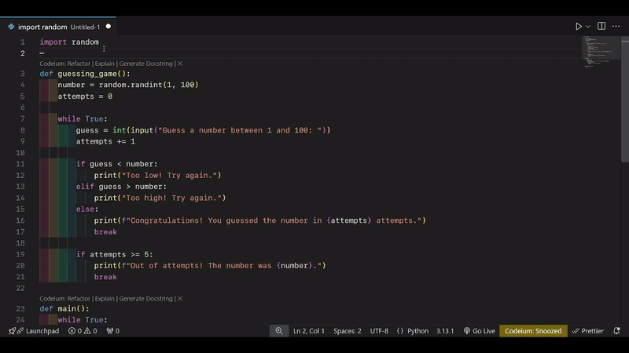
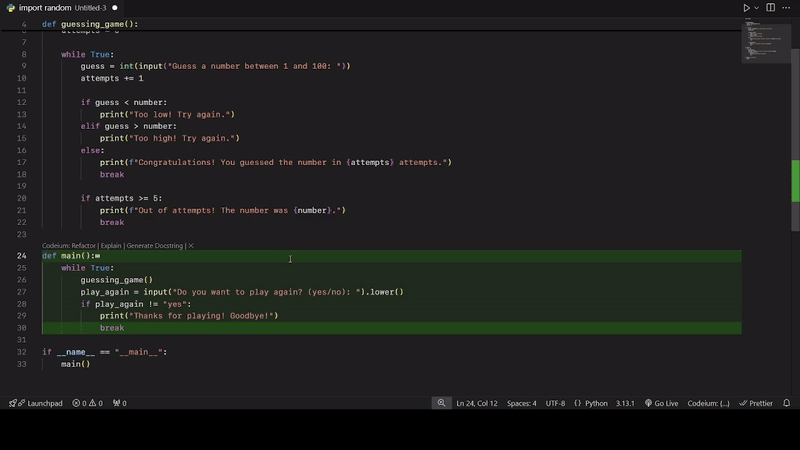

# PyScope - Python Code Block Highlighter 🎨🐍

**Tired of losing track of your Python code blocks?**
**Struggling to see where that `if` statement ends or where your `def` begins?**
**Say hello to PyScope!** 🚀

---

## What is PyScope? 🤔

PyScope is your new best friend for writing Python code in VS Code. It **highlights code blocks** (like functions, loops, and conditionals) with beautiful background colors, making it super easy to see where each block starts and ends. No more squinting at indentation! 👀



---

## Why Use PyScope? 🌟

- **Visualize Python Blocks**: See your `def`, `if`, `for`, and other blocks clearly with colorful highlights.
- **No More Indentation Confusion**: Never lose track of where a block ends, even in deeply nested code.
- **Customizable Colors**: Make it your own with customizable highlight colors. 🎨
- **Lightweight & Fast**: Works seamlessly without slowing down your editor. ⚡

---

## How Does It Work? 🛠️

PyScope uses Python's **indentation rules** to dynamically detect code blocks. When you move your cursor, it highlights:

- The **entire block** (with a subtle background color).
- The **first line** (with a darker highlight).
- The **last line** (with a darker highlight).

It’s like having **X-ray vision** for your Python code! 👓

---

## Features ✨

- **Dynamic Block Detection**: Automatically detects blocks as you type.
- **Cursor Tracking**: Highlights the block where your cursor is. 🖱️
- **Supports All Python Keywords**: Works with `def`, `class`, `if`, `else`, `for`, `while`, `try`, `except`, and more.
- **Customizable**: Change highlight colors and opacity to match your theme. 🎨

---

## Installation 🚀

1. Open **VS Code**.
2. Go to the **Extensions Marketplace** (`Ctrl+Shift+X`).
3. Search for **PyScope**.
4. Click **Install**.
5. Open a Python file and watch the magic happen! ✨

---

## Configuration ⚙️

Customize PyScope to fit your style!
You can change the color of the highlighted blocksby providing RGB values of the color you like. You can do this from the settings

### How to change in the settings

1. Open settings `Ctrl+Comma` for windows, `Cmd+Comma` for mac
2. Search for `pyScope` and look for `Block Highlight Color`
3. Provide you desired RGB value in that field
4. You can leave the field blank to use the default color



Or open `settings.json` and look for `pyScope.blockHighlightColor` and you can configure the color there too.

```json
"pyScope.blockHighlightColor": "27, 153, 5",
```

or by using the command `pyScope.changeColor`.


---

## Support & Feedback 💬

Love PyScope? Hate it? Found a bug?Let me know!

- **GitHub Issues**: [Report an Issue](https://github.com/pasturikaustubh/py-scope/issues)
- **Feature Requests**: [Suggest a Feature](https://github.com/pasturikaustubh/py-scope/discussions)
- **Star the Repo**: [GitHub Repo](https://github.com/pasturikaustubh/py-scope) ⭐

---

## Contributing 🤝

Want to make PyScope even better? Contributions are welcome!
Feel free to fork the repo, make the changes and raise a PR! We'll discuss the changes
[Fork Repository](https://github.com/paturikaustubh/py-scope/fork)

---

## License 📜

PyScope is open-source and licensed under the **MIT License**.
Do whatever you want with it (just give credit where it’s due)! 😄

---

## Made with ❤️ by Kaustubh Paturi

Coding should be fun, and PyScope is here to make it even more enjoyable.
Happy coding! 🎉🐍

---

**P.S.** If you love PyScope, share it with your friends and spread the word! 🌍✨

# \***\*_Nothing great ever came that easy_\*\***
