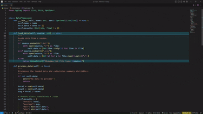

# PyScope - Python Code Block Highlighter 🎨🐍

**Tired of losing track of your Python code blocks?**
**Struggling to see where that `if` statement ends or where your `def` begins?**
**Say hello to PyScope!** 🚀

---

## What is PyScope? 🤔

PyScope is your new best friend for writing Python code in VS Code. It **highlights code blocks** (like functions, loops, and conditionals) with beautiful background colors, making it super easy to see where each block starts and ends. No more squinting at indentation! 👀

---

## Why Use PyScope? 🌟

- **Visualize Python Blocks**: See your `def`, `if`, `for`, and other blocks clearly with colorful highlights.
- **No More Indentation Confusion**: Never lose track of where a block ends, even in deeply nested code.
- **Customizable Colors**: Make it your own with customizable highlight colors. 🎨
- **Lightweight & Fast**: Works seamlessly without slowing down your editor. ⚡

---

## How Does It Work? 🛠️

PyScope uses Python's **indentation rules** to dynamically detect code blocks. When you move your cursor, it highlights:

- The **entire block** (with a subtle background color).
- The **first line** (with a darker highlight).
- The **last line** (with a darker highlight).

It’s like having **X-ray vision** for your Python code! 👓

---

## Features ✨

### Dynamic Block Highlighting

PyScope automatically detects and highlights the code block your cursor is currently in. This works for all Python keywords.

### Customizable Highlight Color

You can change the color of the highlighted blocks to match your theme or preference.

**Using the `pyScope.changeColor` Command:**
Run the command from the command palette (`Ctrl+Shift+P`) and choose from a list of preset colors or select "Custom..." to open a color picker.

### Customizable Highlight Opacity

You can also adjust the opacity of the block highlight and the first/last line highlight separately.

**Using the `pyScope.changeOpacity` Command:**
Run the command from the command palette and choose which opacity setting you want to change. Then, enter a value between 0 and 1.

### Block Selection

PyScope also allows you to select the entire code block with a single command.

**Using the `pyScope.selectBlock` Command:**
Run the command from the command palette to select the current block. You can run it multiple times to select parent blocks in a nested structure.

**Using the `pyScope.undoBlockSelection` Command:**
Run this command to undo the last block selection.

---

## Installation 🚀

1. Open **VS Code**.
2. Go to the **Extensions Marketplace** (`Ctrl+Shift+X`).
3. Search for **PyScope**.
4. Click **Install**.
5. Open a Python file and watch the magic happen! ✨

---

## Support & Feedback 💬

Love PyScope? Hate it? Found a bug?Let me know!

- **GitHub Issues**: [Report an Issue](https://github.com/paturikaustubh/py-scope/issues)
- **Feature Requests**: [Suggest a Feature](https://github.com/paturikaustubh/py-scope/discussions)
- **Star the Repo**: [GitHub Repo](https://github.com/paturikaustubh/py-scope) ⭐

---

## Contributing 🤝

Want to make PyScope even better? Contributions are welcome!
Feel free to fork the repo, make the changes and raise a PR! We'll discuss the changes
[Fork Repository](https://github.com/paturikaustubh/py-scope/fork)

---

## License 📜

PyScope is open-source and licensed under the **MIT License**.
Do whatever you want with it (just give credit where it’s due)! 😄

---

## Made with ❤️ by Kaustubh Paturi

Coding should be fun, and PyScope is here to make it even more enjoyable.
Happy coding! 🎉🐍

---

**P.S.** If you love PyScope, share it with your friends and spread the word! 🌍✨

---

# _**Nothing great ever came that easy**_
